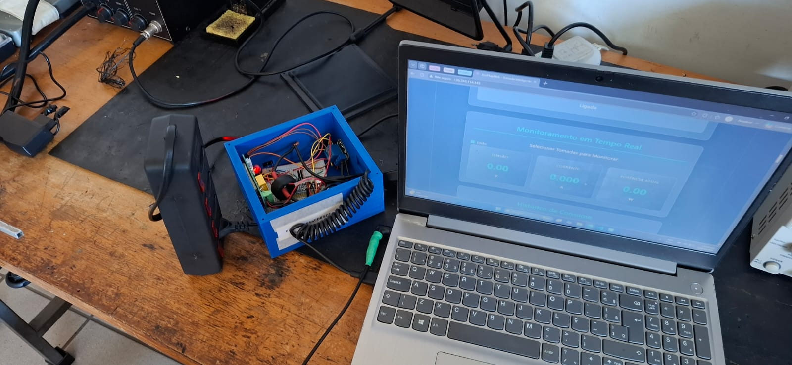
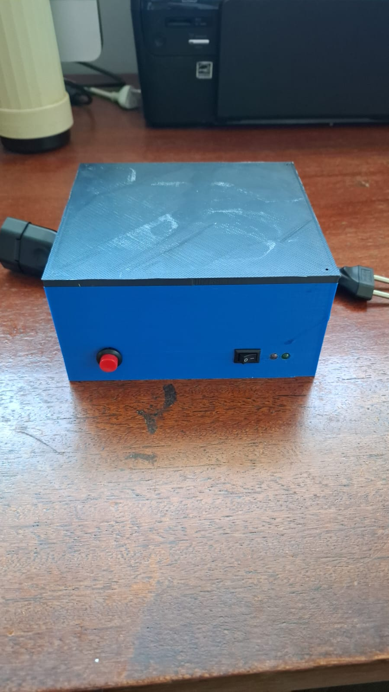
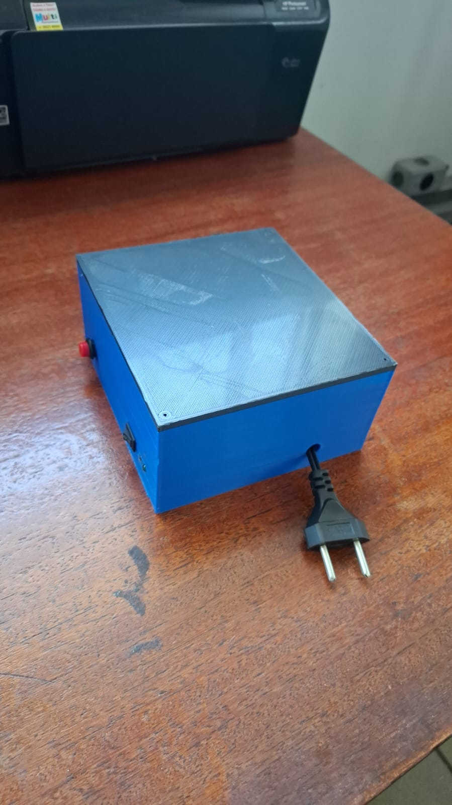
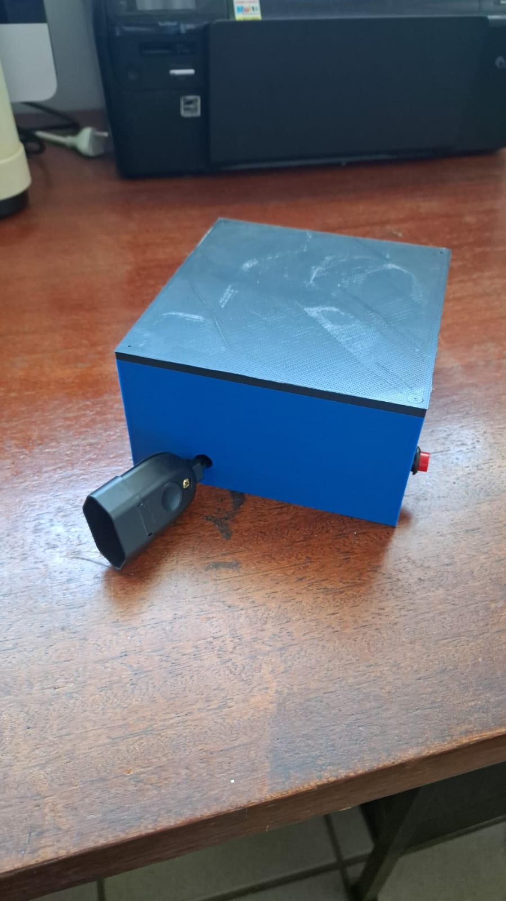
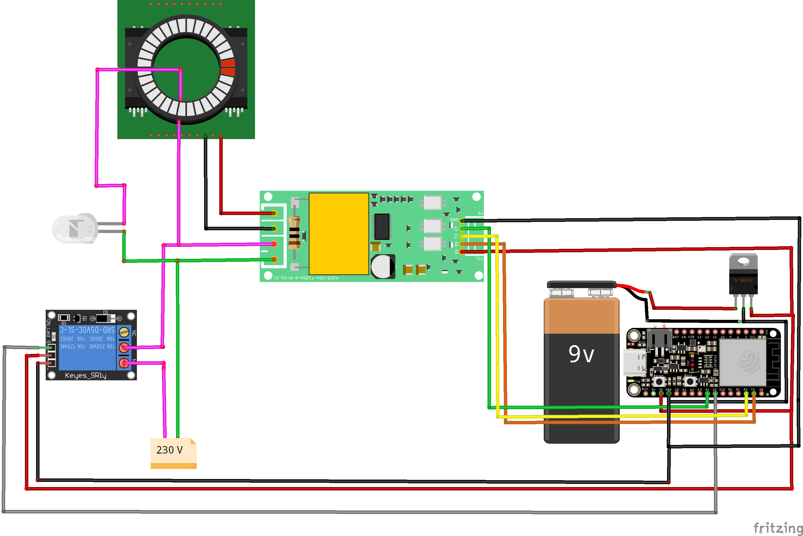

# EcoPlug — Tomada Inteligente

Projeto desenvolvido para a disciplina de **Projeto de Sistemas Embutidos** do Curso de Graduação em Engenharia Elétrica da **Universidade Federal de Minas Gerais (UFMG)**.

O EcoPlug é uma tomada inteligente capaz de medir tensão, corrente, potência e energia acumulada de um aparelho conectado, disponibilizar essas informações ao usuário por meio de uma interface web e permitir o controle remoto do acionamento (ligar/desligar). O sistema sinaliza seu estado por LEDs indicadores e suporta múltiplas tomadas simultaneamente.

## Imagens

| | |
|---|---|
|  |  |
| Protótipo em bancada com dashboard no navegador | Painel frontal: botão de reset, chave e LEDs de status |
|  |  |
| Caixa fechada — entrada de energia (plug macho) | Lateral com tomada de saída (fêmea) |

### Esquemático elétrico



## Arquitetura

```
┌──────────────────────────────────────────────────┐
│              Hardware (ESP32 + PZEM-004T)        │
│   - Mede tensão, corrente, potência, energia     │
│   - WiFi Enterprise (WPA2-EAP / UFMG)           │
│   - Relé NC para controle da tomada             │
└──────────────────┬───────────────────────────────┘
                   │ POST JSON a cada 5s
                   ↓
┌──────────────────────────────────────────────────┐
│         Backend (FastAPI + PostgreSQL)           │
│   - Armazena leituras no banco de dados         │
│   - Autenticação JWT                            │
│   - API REST: energia, dispositivos, gráficos   │
└──────────────────┬───────────────────────────────┘
                   │ GET JSON (polling 5s)
                   ↓
┌──────────────────────────────────────────────────┐
│         Frontend (React + Vite)                  │
│   - Dashboard em tempo real                     │
│   - Gráficos de consumo (potência / custo)      │
│   - Gerenciamento e controle de tomadas         │
└──────────────────────────────────────────────────┘
```

## Estrutura do Projeto

```
Tomada-Inteligente/
├── Backend/
│   ├── main.py                # Servidor FastAPI
│   ├── models.py              # Modelos SQLAlchemy
│   ├── schemas.py             # Schemas Pydantic
│   ├── database.py            # Conexão PostgreSQL
│   ├── security.py            # JWT e autenticação
│   ├── routers/
│   │   ├── auth.py            # Login / registro
│   │   ├── devices.py         # CRUD de dispositivos
│   │   └── energia.py         # Leituras e gráficos
│   ├── requirements.txt
│   └── .env.example
├── Frontend/
│   ├── src/
│   │   ├── components/
│   │   │   ├── Header.jsx
│   │   │   ├── ManagementSection.jsx
│   │   │   ├── ControlSection.jsx
│   │   │   ├── MonitoringSection.jsx
│   │   │   ├── ChartFilterSection.jsx
│   │   │   └── HistorySection.jsx
│   │   ├── pages/
│   │   │   ├── HomePage.jsx
│   │   │   └── LoginPage.jsx
│   │   ├── hooks/
│   │   │   └── useSockets.js
│   │   ├── services/
│   │   │   ├── socketService.js
│   │   │   └── authService.js
│   │   ├── config.js
│   │   ├── App.jsx
│   │   └── main.jsx
│   ├── .env.production
│   ├── package.json
│   └── vite.config.js
├── hardware/
│   └── controle.ino           # Firmware ESP32
├── imagens/                   # Screenshots e fotos do hardware
└── README.md
```

## Hardware

| Componente | Função |
|---|---|
| ESP32 | Controlador principal + WiFi |
| PZEM-004T | Medidor de tensão, corrente, potência e energia (com núcleo toroidal para leitura de corrente) |
| Relé NC | Controle da tomada (fail-safe: ligada sem energia no relé) |
| LED vermelho (GPIO 22) | Sistema energizado; pisca 3x no reset |
| LED verde (GPIO 23) | WiFi conectado |
| Botão (GPIO 5) | Reset de fábrica (segurar 5s) |

O circuito é montado dentro de um **invólucro impresso em 3D** (cor azul), com entrada de energia (plugue macho) e saída para o aparelho (tomada fêmea) expostos externamente. A eletrônica de controle é alimentada de forma autônoma, independente da carga monitorada.

**Especificações:**
- Tensão medida: 80–260 V CA
- Corrente máxima: 10 A (CT embutido do PZEM-004T)
- Amostragem interna do sensor: ~1 s
- Intervalo de envio ao servidor: 5 s
- Atualização da interface web: ~5 s (polling)
- Erro de medição: < 5%
- Conexão: WPA2-Enterprise (EAP-PEAP) — compatível com redes institucionais (UFMG/Eduroam)

## Configuração do Hardware

1. Ligar o ESP32 pela primeira vez
2. Conectar ao AP `Tomada-Setup` (senha: `12345678`)
3. Acessar `http://192.168.4.1`
4. Preencher SSID, usuário e senha da rede
5. O dispositivo reinicia e começa a enviar dados

Para redefinir as credenciais: segurar o botão de reset por 5 segundos.

## Configuração do Backend

```bash
cd Backend
cp .env.example .env      # preencher DATABASE_URL e SECRET_KEY
pip install -r requirements.txt
uvicorn main:app --host 0.0.0.0 --port 5000
```

## Configuração do Frontend

```bash
cd Frontend
npm install
# Desenvolvimento
npm run dev

# Produção
npm run build             # gera dist/
```

Editar `Frontend/.env.production` para apontar para o servidor:

```env
VITE_API_BASE_URL=http://seu-servidor:5000
```

## Deploy (Produção)

O backend roda em Oracle Cloud (Ubuntu 22.04) com FastAPI + Uvicorn gerenciado pelo systemd e nginx como proxy reverso. O frontend é servido como site estático pelo nginx.

## Endpoints principais da API

| Método | Rota | Descrição |
|---|---|---|
| POST | `/api/auth/register` | Cadastro de usuário |
| POST | `/api/auth/login` | Login (retorna JWT) |
| GET | `/api/devices/` | Listar dispositivos |
| POST | `/api/devices/claim` | Vincular dispositivo |
| PATCH | `/api/devices/{serial}` | Renomear dispositivo |
| DELETE | `/api/devices/{serial}` | Desvincular dispositivo |
| POST | `/api/devices/{serial}/relay` | Acionar relé |
| POST | `/api/energia/{serial}` | Receber leitura do ESP32 |
| GET | `/api/energia/{serial}` | Última leitura |
| GET | `/api/energia/{serial}/chart` | Dados para gráfico |

## Próximos Passos

- [x] Gráfico de custo em reais por período (já implementado na interface)
- [ ] Validação com múltiplas tomadas operando simultaneamente em campo
- [ ] Alertas por e-mail quando consumo exceder limite configurado
- [ ] Autenticação do dispositivo com token fixo no header HTTP
- [ ] Exportar histórico de consumo em CSV
- [ ] Suporte a WPA2 pessoal (além de Enterprise) no portal de configuração
- [ ] App mobile (React Native ou PWA)

## Autores

- Bruno dos Santos Lopes
- Heitor Franco Cerceaux Linhares
